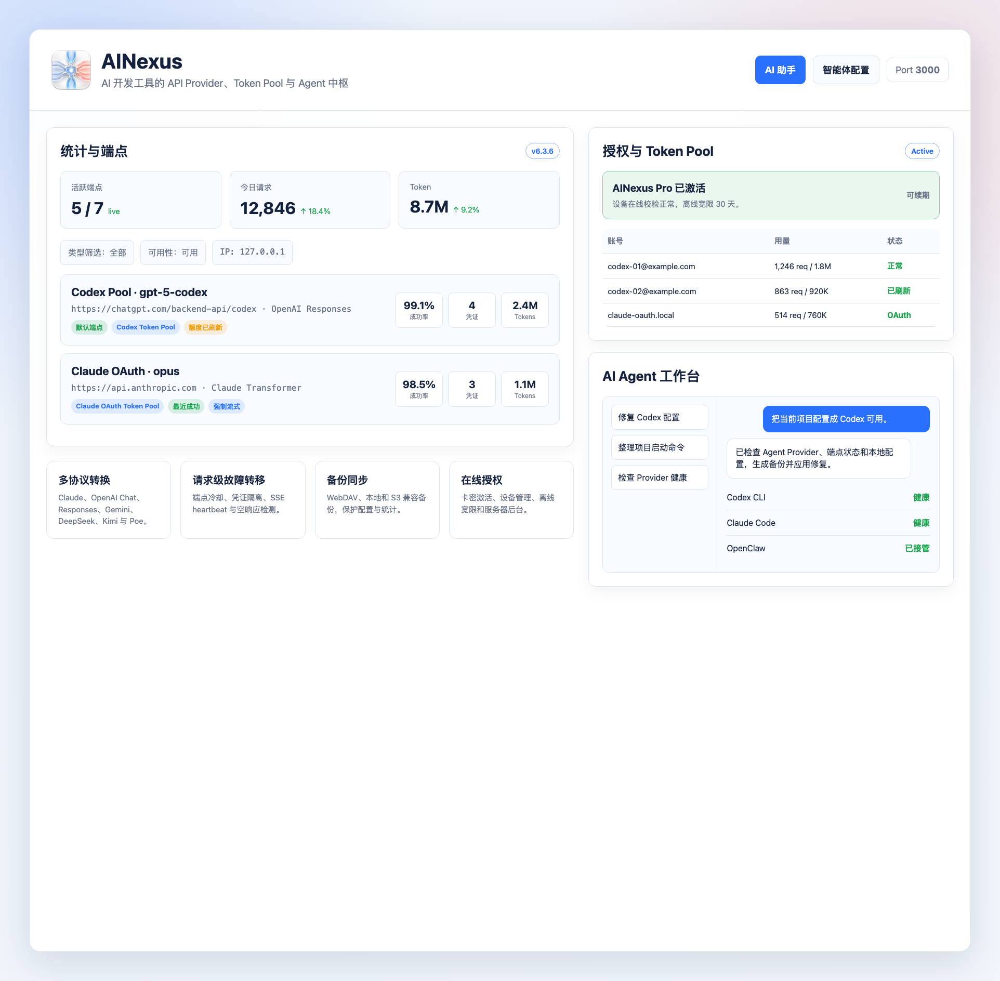
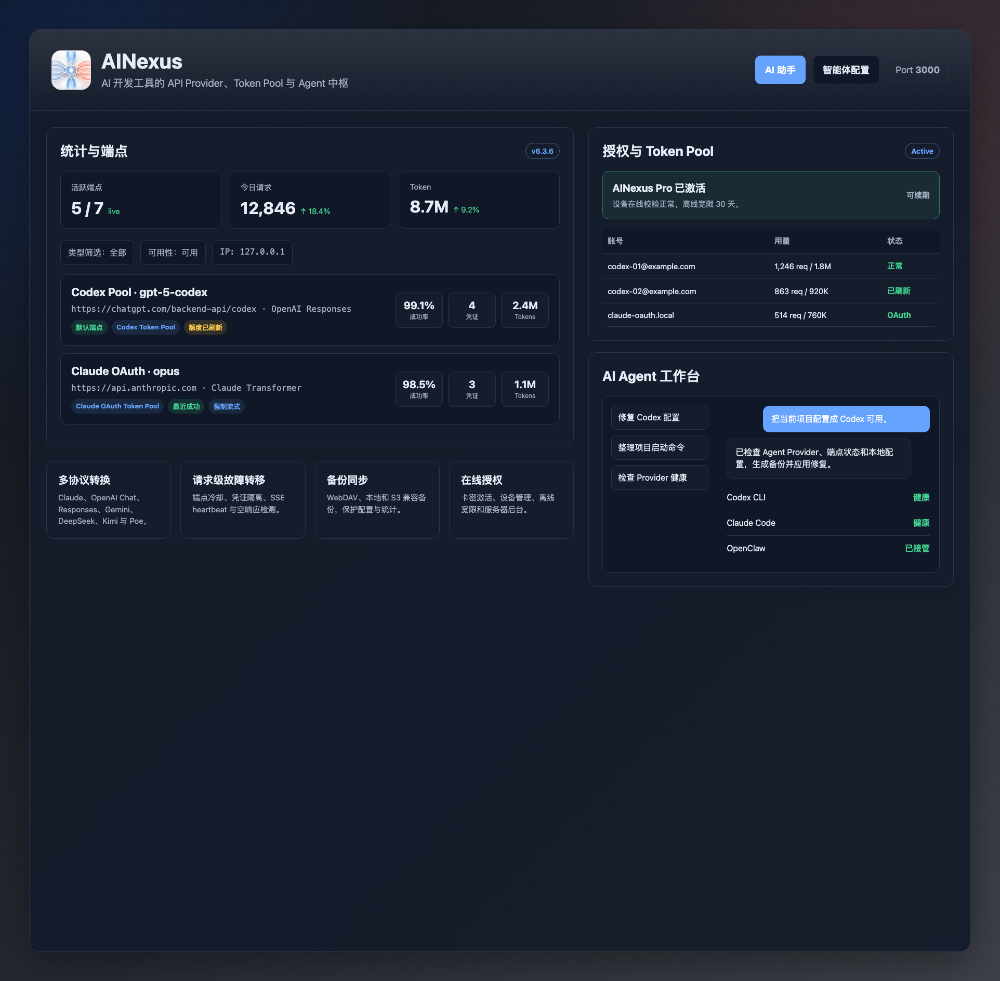

<div align="center">

<p align="center">
  
</p>

[](https://github.com/jackychanisnotme/AINexus/actions)
[](https://github.com/jackychanisnotme/AINexus/releases/latest)
[](LICENSE)
[](https://go.dev/)
[](https://wails.io/)

[English](docs/README_EN.md) | [简体中文](README.md)

</div>

AINexus 不只是 Claude Code、Codex CLI、Hermes Agent 与 OpenClaw 的智能端点轮换代理，也是一套面向 AI 开发工作流的 API 资源管理系统。它把端点、模型、密钥、Codex Token Pool、额度、统计和备份统一管理起来，并对外提供一个稳定的本地 API Provider：Hermes、OpenClaw、Codex、Claude Code 等客户端只需指向 AINexus，就可以在不同上游、账号、模型之间热切换，无需反复修改每个工具的配置。

> [!IMPORTANT]
> 当前仓库维护 Optimized 版本，重点增强 Codex CLI、Claude Code、Hermes Agent、OpenClaw、OpenAI Responses API、DeepSeek、Kimi 等兼容场景。
>
> 最新发布：[`AINexus Optimized`](https://github.com/jackychanisnotme/AINexus/releases/latest)

## 功能特性

- **统一 API Provider**：Claude Code、Codex CLI、Hermes Agent、OpenClaw、OpenAI Chat/Responses 兼容客户端都可以接入同一个本地地址
- **多客户端热切换**：把 Hermes、OpenClaw、Codex、Claude Code 的 provider/base URL 都指向 AINexus 后，在 AINexus 中切换当前端点、启停端点或调整优先级，客户端即可无感切到新的上游、账号或模型
- **API 资源管理**：集中管理端点、模型、API Key、Token Pool、额度快照、用量统计和备份数据
- **多端点轮换与故障转移**：按顺序轮换可用端点，失败自动跳过并切换，降低单个上游异常对工作流的影响
- **多协议格式转换**：支持 Claude、OpenAI Chat、OpenAI Responses、Gemini、DeepSeek、Kimi/Moonshot 等格式互转
- **Codex Token Pool**：批量导入 `access_token/refresh_token`，自动轮换、401 后刷新、失效隔离，并固定适配 ChatGPT Codex 后端
- **Token Pool 额度与用量统计**：捕获 Codex 额度快照，按单条凭证展示请求数、错误数、Token 用量和最近使用状态
- **端点级推理控制**：为支持的端点配置 `low` / `medium` / `high` / `xhigh` 推理强度，也可显式关闭上游 thinking
- **上游强制流式兼容**：当上游拒绝非流式请求时，可强制使用流式上游并为非流式客户端聚合结果
- **模型聚合与兼容接口**：提供 `/v1/models`、`/models`、`/api/tags`、`/version`、`/props`、`/health`、`/stats` 等接口，便于客户端探测和监控
- **实时统计与可视化**：事件驱动更新，支持今日/昨日/本周/本月快速切换，并可按端点、凭证维度查看
- **桌面端 + 服务器端**：Wails 桌面应用适合本机使用，`cmd/server` 无头模式适合服务器、NAS 或 Docker 部署
- **备份同步**：支持 WebDAV、本地备份和 S3 兼容存储，便于多设备迁移配置与统计数据

## 与初代版本的设计取舍

Optimized 版本延续了 [lich0821/AINexus](https://github.com/lich0821/AINexus) 初代项目“本地统一代理入口”的核心思路，但把重点从简单轮换扩展到长期运行、多端点并发和复杂上游错误恢复。初代逻辑更直接，适合轻量场景；Optimized 版本更强调韧性、可观测性和 Codex/Responses 兼容。

| 维度 | 初代版本优势 | Optimized 版本增强 |
|------|--------------|--------------------|
| 故障切换模型 | 失败后全局轮换端点，行为直观，排查简单 | 单次请求内 fallback，不轻易改变全局默认端点，并发请求互不污染 |
| 错误识别 | 策略简单，维护成本低 | 区分额度耗尽、限流、上游 5xx、网络异常、API Key 失效、客户端 invalid request 等场景 |
| 端点恢复 | 没有额外状态，结果容易预测 | 失败端点进入可配置冷却，恢复后可自动返回或降优先级，减少反复打坏端点 |
| 流式稳定性 | 实现简洁，接近传统 HTTP 代理行为 | 支持 SSE heartbeat、上游强制流式、流式错误分类和 200 但空输出的语义检测 |
| 运维可见性 | 基础日志和统计 | Request ID、重试次数、失败原因、端点运行态与凭证级用量/额度快照 |

如果只需要一个简单的本地轮换代理，初代设计非常清爽；如果要把 Claude Code、Codex CLI、Hermes Agent、OpenClaw、Token Pool 和多个第三方上游长期放在一起跑，并在这些客户端之间共享同一个可热切换的 API Provider，Optimized 版本提供了更细的隔离、恢复和观测能力。

## 客户端兼容状态

| 客户端 | 推荐接入方式 | 当前状态 |
|--------|--------------|----------|
| Claude Code | Claude / Anthropic 兼容入口 | 稳定支持 |
| Codex CLI | OpenAI Responses API，推荐 `openai2` 转换器 | 稳定支持 |
| Hermes Agent | 按其客户端协议选择 Claude 或 OpenAI 兼容入口 | 稳定支持 |
| OpenClaw | Claude 或 OpenAI 兼容入口 | 稳定支持 |

<table>
  <tr>
    <td align="center"></td>
    <td align="center"></td>
  </tr>
</table>

## 快速开始

### 1. 下载安装

[下载当前 fork 最新版本](https://github.com/jackychanisnotme/AINexus/releases/latest)

- **macOS**：下载 `.zip` 后解压，将 `AINexus.app` 移动到「应用程序」，首次运行右键点击 → 打开
- **Windows**：下载 `windows-amd64.zip` 后解压，运行 `AINexus.exe`
- **Linux**：可从源码构建，或使用服务器模式/Docker 部署
- **服务器模式**：`cd cmd/server && go run main.go`

### 2. 添加端点

点击「添加端点」，填写 API 地址、密钥、认证方式、转换器和目标模型。

常用转换器：
- `claude`：Claude / Anthropic 兼容接口
- `openai`：OpenAI Chat Completions 兼容接口
- `openai2`：OpenAI Responses API，推荐给 Codex CLI
- `gemini`：Google Gemini
- `deepseek`：DeepSeek Chat 兼容接口
- `kimi`：Kimi / Moonshot 兼容接口

如需使用 Codex Token Pool：
- 认证方式选择 `Codex Token Pool`
- 在 Token Pool 页面导入一批 token JSON（支持 `access_token` + `refresh_token`）
- 系统会自动设置上游地址与 `openai2` 转换器，并处理 token 轮换、401 后刷新、额度快照和状态管理

可选增强：
- 对支持 reasoning 的端点启用「推理」，选择推理强度
- 上游只接受流式时，启用「上游强制流式」
- 点击模型选择旁的拉取按钮，快速获取上游模型列表

### 3. 配置客户端

#### Claude Code
`~/.claude/settings.json`
```json
{
  "env": {
    "ANTHROPIC_AUTH_TOKEN": "随便写，不重要",
    "ANTHROPIC_BASE_URL": "http://127.0.0.1:3000",
    "CLAUDE_CODE_MAX_OUTPUT_TOKENS": "64000", // 有些模型可能不支持 64k
  }
  // 其他配置
}

```

#### Codex CLI
推荐使用 Responses API：
```toml
model_provider = "AINexus"
model = "gpt-5-codex"
preferred_auth_method = "apikey"

[model_providers.AINexus]
name = "AINexus"
base_url = "http://localhost:3000/v1"
wire_api = "responses"  # 或 "chat"

# 其他配置
```

`~/.codex/auth.json` 可以忽略，认证由 AINexus 端点或 Token Pool 负责。

## 运行模式

| 模式 | 入口 | 适合场景 |
|------|------|----------|
| 桌面模式 | `cmd/desktop` | 本机 GUI、托盘运行、可视化端点和 Token Pool 管理 |
| 服务器模式 | `cmd/server` | 远程服务器、NAS、Docker、无头 API 代理 |

服务器模式支持 `AINEXUS_PORT`、`AINEXUS_LOG_LEVEL`、`AINEXUS_DB_PATH`、`AINEXUS_DATA_DIR`、`AINEXUS_BASIC_AUTH_USERNAME`、`AINEXUS_BASIC_AUTH_PASSWORD` 等环境变量。

## 文档

- [详细配置](docs/configuration.md)
- [开发指南](docs/development.md)
- [常见问题](docs/FAQ.md)

## 许可证

本项目不再采用 MIT 许可证。源码可用于非商业个人、学习、研究与评估用途；任何商业使用都必须先获得版权所有者的书面授权。详见 [LICENSE](LICENSE)。
