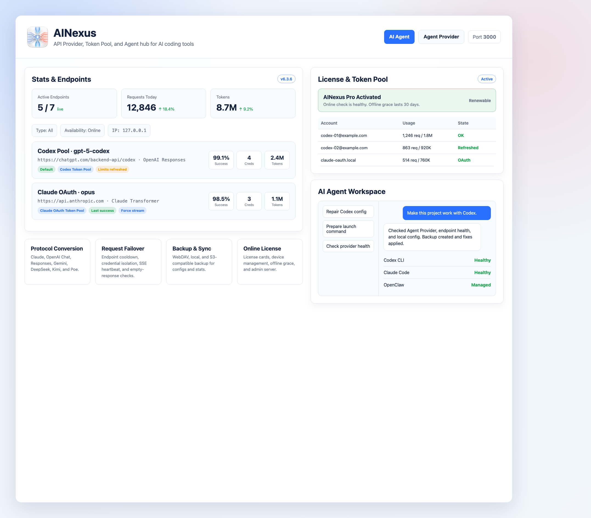
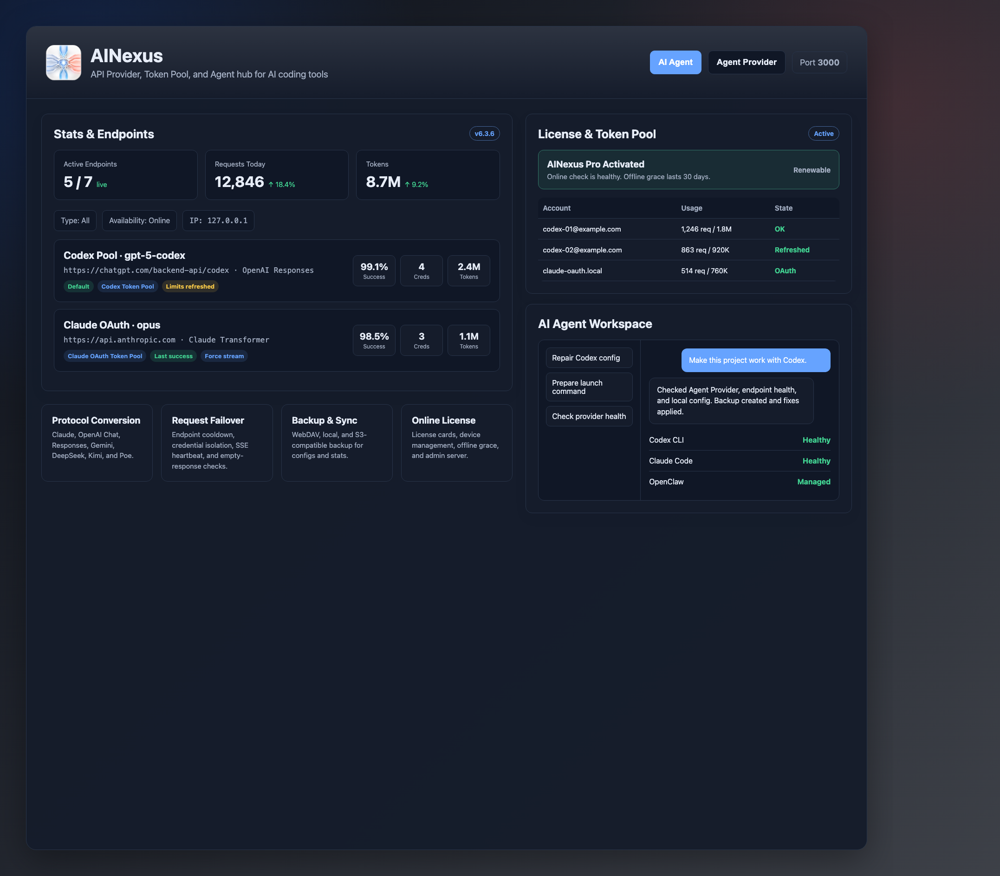

<div align="center">

<p align="center">
  
</p>

[](https://github.com/jackychanisnotme/ccNexus/actions)
[](https://github.com/jackychanisnotme/ccNexus/releases/latest)
[](../LICENSE)
[](https://go.dev/)
[](https://wails.io/)

[English](README_EN.md) | [简体中文](../README.md)

</div>

ccNexus is more than a smart endpoint rotation proxy for Claude Code, Codex CLI, Hermes Agent, and OpenClaw. It is an API resource management system for AI development workflows, bringing endpoints, models, API keys, Codex Token Pools, quota snapshots, usage statistics, and backups into one local control plane. It also works as a stable local API provider: point Hermes, OpenClaw, Codex, Claude Code, and compatible clients at ccNexus once, then hot-switch between upstream providers, accounts, and models without repeatedly editing every tool's config.

> [!IMPORTANT]
> This fork maintains the Optimized line, with extra compatibility for Codex CLI, Claude Code, Hermes Agent, OpenClaw, OpenAI Responses API, DeepSeek, and Kimi/Moonshot.
>
> Latest release: [`ccNexus Optimized`](https://github.com/jackychanisnotme/ccNexus/releases/latest)
>
> Licensing: the original upstream code from `lich0821/ccNexus` remains under the MIT License. Additions and modifications made in this fork, including ccNexus Optimized source changes, builds, documentation, UI, and branding assets, are licensed under a non-commercial source-available license. Release binaries are free for personal, non-commercial use. Commercial use requires a separate written license.

## Features

- **One Local API Provider**: Connect Claude Code, Codex CLI, Hermes Agent, OpenClaw, OpenAI Chat/Responses-compatible clients, and model tools to one local base URL
- **Hot Switching Across Clients**: Point Hermes, OpenClaw, Codex, and Claude Code provider/base URLs at ccNexus, then switch the current endpoint, enable or disable endpoints, or adjust priority in ccNexus to move clients to a new upstream, account, or model without changing each client again
- **API Resource Management**: Manage endpoints, models, API keys, Token Pools, quota snapshots, usage statistics, and backup data in one place
- **Endpoint Rotation and Failover**: Rotate across enabled endpoints and skip failing upstreams automatically
- **Protocol Conversion**: Convert between Claude, OpenAI Chat, OpenAI Responses, Gemini, DeepSeek, and Kimi/Moonshot formats
- **Codex Token Pool**: Bulk import `access_token/refresh_token`, rotate credentials, refresh after 401s, isolate invalid tokens, and target the ChatGPT Codex backend automatically
- **Credential Usage and Rate Insights**: Capture Codex quota snapshots and show per-credential requests, errors, token usage, and recent activity
- **Endpoint-Level Reasoning Control**: Set `low` / `medium` / `high` / `xhigh` reasoning effort, or explicitly disable upstream thinking where supported
- **Forced Streaming Upstream Mode**: Use streaming upstream requests for providers that reject non-streaming calls while aggregating output for non-streaming clients
- **Model and Compatibility APIs**: Serve `/v1/models`, `/models`, `/api/tags`, `/version`, `/props`, `/health`, and `/stats` for client discovery and monitoring
- **Live Statistics**: Event-driven usage updates with today/yesterday/week/month views
- **Desktop and Server Modes**: Use the Wails desktop app locally, or run `cmd/server` headlessly on a server, NAS, or Docker host
- **Backup and Sync**: Support WebDAV, local backups, and S3-compatible storage

## Design Trade-Offs vs. the Original Project

The Optimized line keeps the original [lich0821/ccNexus](https://github.com/lich0821/ccNexus) idea of one local proxy gateway, while shifting the focus from simple rotation to long-running, multi-endpoint, concurrent AI workflows. The original design is smaller and easier to reason about; the Optimized line puts more weight on resilience, observability, and Codex/Responses compatibility.

| Area | Original Strength | Optimized Improvement |
|------|-------------------|-----------------------|
| Failover model | Global endpoint rotation after failures, direct and easy to inspect | Request-local fallback that avoids changing the global default endpoint for unrelated requests |
| Error handling | Simple policy with low maintenance overhead | Classifies quota exhaustion, rate limits, upstream 5xx, network errors, API key failures, and wrapped invalid requests |
| Endpoint recovery | Minimal hidden state, highly predictable behavior | Configurable cooldowns with auto-return or deprioritization for recovered endpoints |
| Streaming reliability | Compact traditional proxy behavior | SSE heartbeat, forced upstream streaming, streaming error classification, and semantic empty-output detection |
| Operations visibility | Basic logs and stats | Request IDs, attempt headers, retry reasons, endpoint runtime state, and per-credential usage/quota snapshots |

For a lightweight local rotation proxy, the original version remains refreshingly simple. For running Claude Code, Codex CLI, Hermes Agent, OpenClaw, Token Pools, and multiple third-party upstreams together for long sessions while sharing one hot-switchable API provider across clients, the Optimized line provides stronger isolation, recovery, and visibility.

## Client Compatibility

| Client | Recommended Entry | Status |
|--------|-------------------|--------|
| Claude Code | Claude / Anthropic-compatible gateway | Stable |
| Codex CLI | OpenAI Responses API, preferably with the `openai2` transformer | Stable |
| Hermes Agent | Claude or OpenAI-compatible gateway, depending on the client protocol | Stable |
| OpenClaw | Claude or OpenAI-compatible gateway | Stable |

<table>
  <tr>
    <td align="center"></td>
    <td align="center"></td>
  </tr>
</table>

## Quick Start

### 1. Download and Install

[Download the latest release from this fork](https://github.com/jackychanisnotme/ccNexus/releases/latest)

- **macOS**: Extract the `.zip`, move `ccNexus.app` to Applications, then right-click → Open for the first run
- **Windows**: Download `windows-amd64.zip`, extract it, then run `ccNexus.exe`
- **Linux**: Build from source, or use server mode/Docker
- **Server mode**: `cd cmd/server && go run main.go`

### 2. Add Endpoints

Click "Add Endpoint", then fill in the API URL, key, auth mode, transformer, and target model.

Common transformers:
- `claude`: Claude / Anthropic-compatible APIs
- `openai`: OpenAI Chat Completions-compatible APIs
- `openai2`: OpenAI Responses API, recommended for Codex CLI
- `gemini`: Google Gemini
- `deepseek`: DeepSeek Chat-compatible APIs
- `kimi`: Kimi / Moonshot-compatible APIs

For Codex Token Pool mode:
- Set auth mode to `Codex Token Pool`
- Import token JSON records in the Token Pool page (`access_token` + `refresh_token`)
- ccNexus will lock the upstream URL and `openai2` transformer, then handle token rotation, 401-triggered refresh, quota snapshots, and lifecycle statuses

Optional enhancements:
- Enable endpoint reasoning and select the effort level for providers that support it
- Enable forced streaming when an upstream only accepts streaming requests
- Use the model fetch button next to the model field to pull upstream model IDs

### 3. Configure Clients

#### Claude Code
`~/.claude/settings.json`
```json
{
  "env": {
    "ANTHROPIC_AUTH_TOKEN": "anything, not important",
    "ANTHROPIC_BASE_URL": "http://127.0.0.1:3000",
    "CLAUDE_CODE_MAX_OUTPUT_TOKENS": "64000", // Some models may not support 64k
  }
  // Other settings
}

```

#### Codex CLI
Responses API is recommended:
```toml
model_provider = "ccNexus"
model = "gpt-5-codex"
preferred_auth_method = "apikey"

[model_providers.ccNexus]
name = "ccNexus"
base_url = "http://localhost:3000/v1"
wire_api = "responses"  # or "chat"

# Other settings
```

`~/.codex/auth.json` can be ignored because ccNexus handles endpoint or Token Pool authentication.

## Runtime Modes

| Mode | Entry | Best For |
|------|-------|----------|
| Desktop | `cmd/desktop` | Local GUI, tray app, visual endpoint and Token Pool management |
| Server | `cmd/server` | Remote servers, NAS, Docker, and headless HTTP proxy usage |

Server mode supports `CCNEXUS_PORT`, `CCNEXUS_LOG_LEVEL`, `CCNEXUS_DB_PATH`, `CCNEXUS_DATA_DIR`, `CCNEXUS_BASIC_AUTH_USERNAME`, and `CCNEXUS_BASIC_AUTH_PASSWORD`.

## Documentation

- [Configuration Guide](configuration_en.md)
- [Development Guide](development_en.md)
- [FAQ](FAQ_en.md)

## Licensing and Commercial Use

This repository uses mixed licensing:

- Original upstream code from `lich0821/ccNexus`: remains under the MIT License. See [THIRD_PARTY_NOTICES.md](../THIRD_PARTY_NOTICES.md).
- Additions and modifications made in this fork: licensed under the [ccNexus Optimized Non-Commercial Source Available License](../LICENSE).
- Release binaries: free for personal, non-commercial use.
- Commercial use, internal business use, SaaS/hosted service use, resale, bundling, redistribution, or white-label use: requires a separate commercial license. See [COMMERCIAL_LICENSE.md](../COMMERCIAL_LICENSE.md).

The `ccNexus` and `ccNexus Optimized` names, logos, icons, and related branding assets are reserved and may not be used for commercial promotion, confusing attribution, or implied endorsement without permission.
